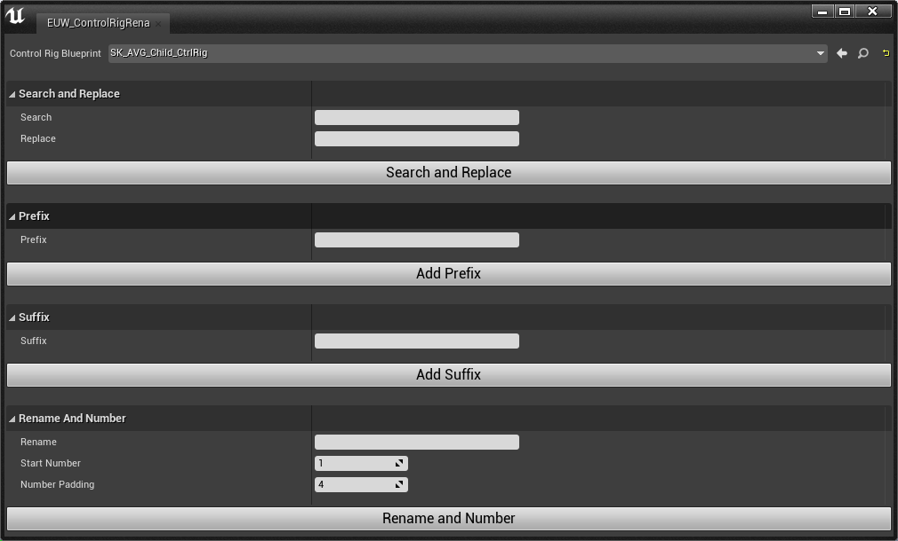
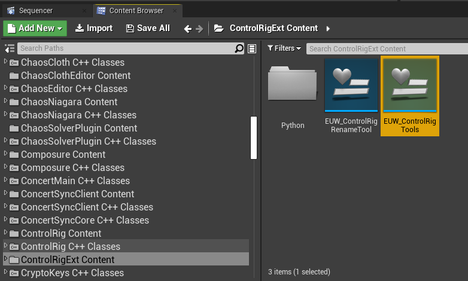
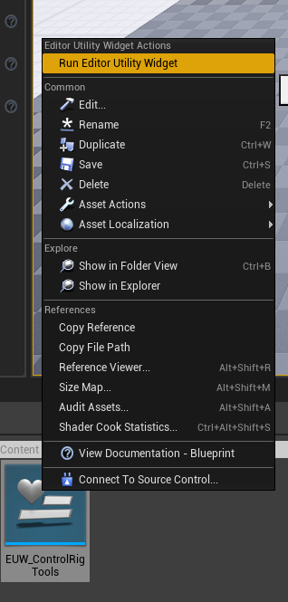
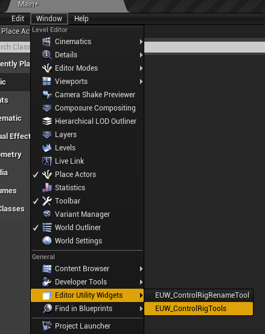
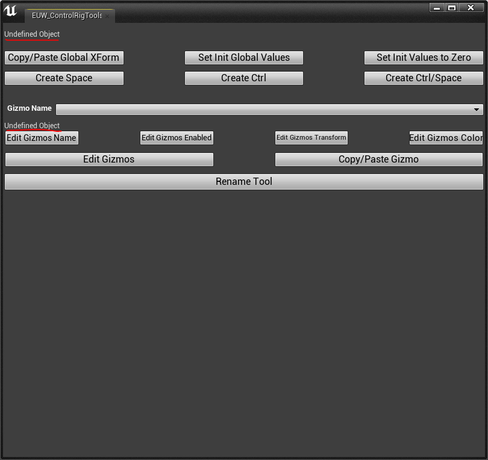
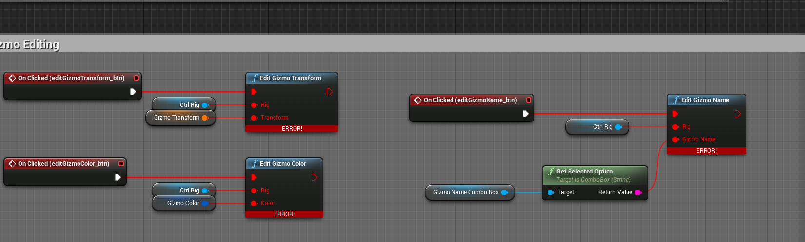
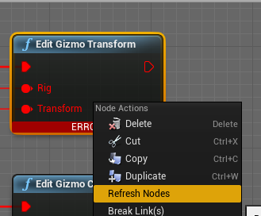
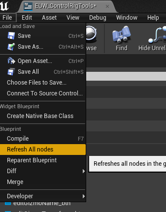

# ControlRigExt
 A extension module for UE4 ControlRig

# Editor Utility Widgets

## Previews

## How to run

Navigate to the ControlRigExt Content folder and open up EUW_ControlRigTools

Right click on it, and hit Run Editor Utility Widget

Once you have done that, you can now run your Editor Utility Widget in Window->Editor Utility Widget

# Troubleshooting

If you ever seen this issue when running the tool

Navigate to the ControlRigExt Content folder and open up EUW_ControlRigTools

You should see the error nodes in the Editor Utility Widget

Select any red node, right click and hit "Refresh Nodes"

Afterwards, you will then go to File->Refresh All Nodes and Save

You will also need to do it for the EUW_ControlRigRenameTool

